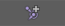
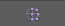

**Deform**
<table>
  <tr>
    <th>Item</th>
    <th>Description</th>
  </tr>
  <tr>
    <td></img></td>
    <td>Create a new Blendshape</td>
  </tr>
  <tr>
    <td></img></td>
    <td>Create a Pose Interpolator Node</td>
  </tr>
  <tr>
    <td></img></td>
    <td>Create a Cluster</td>
  </tr>
</table>
