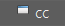

[Built-In](builtIn.md)

<h1 style="font-size:10vw">Windows</h1>

<table>
  <tr>
    <th>Item</th>
    <th>Description</th>
  </tr>
  <tr>
    <td></img></td>
    <td>Connection Editor</td>
  </tr>
  <tr>
    <td></img></td>
    <td>Component Editor</td>
  </tr>
  <tr>
    <td></img></td>
    <td>Node Editor</td>
  </tr>
  <tr>
    <td></img></td>
    <td>Channel Control</td>
  </tr>
  <tr>
    <td></img></td>
    <td>Set Driven Key</td>
  </tr>
  <tr>
    <td></img></td>
    <td>Shape Editor</td>
  </tr>
  <tr>
    <td></img></td>
    <td>Pose Editor</td>
  </tr>
  <tr>
    <td></img></td>
    <td>Graph Editor</td>
  </tr>
</table>
