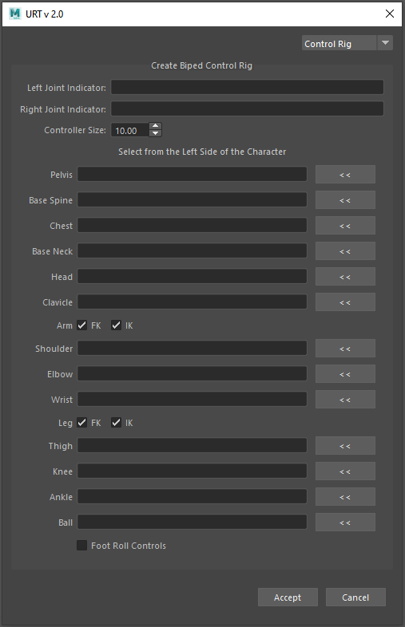

[Tools](toolsOption.md)

<h1 style="font-size:10vw">Control Rig</h1>

[Description]  

[How-To Use Video]  
 

 

<table>
  <tr>
    <th>Item</th>
    <th>Description</th>
  </tr>
  <tr>
    <td><b>Left Joint Indicator:</b></td>
    <td>Input the string that indicates the left joints</td>
  </tr>
  <tr>
    <td><b>Right Joint Indicator:<b></td>
    <td>Input the string that indicates the right joints</td>
  </tr>
  <tr>
    <td><b>Controller Size:<b></td>
    <td>Input the size of the controllers</td>
  </tr>
  <tr>
    <td><b>FK/IK:<b></td>
    <td>Toggle for Forward Kinematics (FK) and Inverse Kinematics (IK) setup</td>
  </tr>
  <tr>
    <td><b>Foot Roll Controls:<b></td>
    <td>Enables the locator that determines the pivot point for the foot roll setup. Visible in the scene when enabled.  
        <b>heelPos:</b> Pivot point for the position on the heel 
        <b>ankleRollInPos:</b> Pivot point on the inside of the leg (on the side). 
        <b>ankleRollOutPos:</b> Pivot point on the outside of the leg (on the side). 
        <b>toeTipPos:</b> Pivot point on the tip of the toes. 
    </td>
  </tr>
</table>
