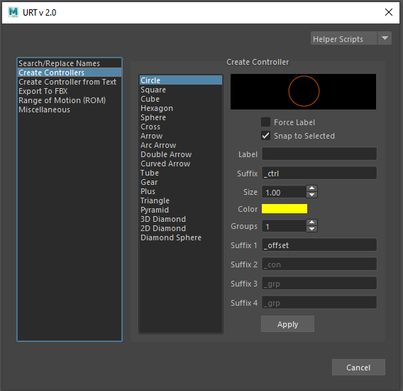

[Description] 
[How-To Use Video] 
 

 
<table>
  <tr>
    <th>Item</th>
    <th>Description</th>
  </tr>
  <tr>
    <td><b>Text Box with Shape Names:</b></td>
    <td>List of shapes to select from</td>
  </tr>
  <tr>
    <td><b>Force Label:<b></td>
    <td>When creating a controller by selecting an object in the scene: 
        Check: To name the controller using the ‘Label’ above 
        Uncheck: To use the name of the selected item </td>
  </tr>
</table>

**Text Box with Shape Names:**	List of shapes to select from 
**Force Label:**	When creating a controller by selecting an object in the scene: 
**Check:** To name the controller using the ‘Label’ above 
**Uncheck:** To use the name of the selected item 
**Snap to Selected:**	When creating a controller by selecting an object in the scene: 
**Check:** To snap the controller to the selected object (with transform) 
**Uncheck:** To create the controller in the origin 
**Label:**	Input the name of the controller 
**Suffix:**	Input the string to include at the end of the controller’s name 
**Size:**	Input the size of the controller 
**Color:**	Determines the color of the controller being created 
**Groups:** Input the number of groups to go over the controller 
**Suffix 1:**	Input the string to include at the end of the first group’s name 
**Suffix 2:**	Input the string to include at the end of the second group’s name 
**Suffix 3:**	Input the string to include at the end of the third group’s name 
**Suffix 4:**	Input the string to include at the end of the fourth group’s name 
