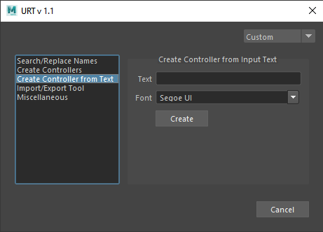

[Description] 

[How-To Use Video] 
 

 

<table>
  <tr>
    <th>Item</th>
    <th>Description</th>
  </tr>
  <tr>
    <td><b>Text:</b></td>
    <td>Input the name of the controller</td>
  </tr>
  <tr>
    <td><b>Font:<b></td>
    <td>Select the font to use (some fonts cannot be used to create controllers)</td>
  </tr>
</table>
