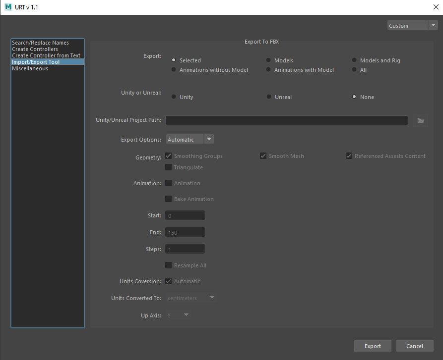

[Description]  

[How-To Use Video]  
 

 

<table>
  <tr>
    <th>Item</th>
    <th>Description</th>
  </tr>
  <tr>
    <td><b>Export:</b></td>
    <td>
    <b>Selected:</b> Exports only the selected objects   
    <b>Models:</b> Exports all the models in the scene   
    <b>Models and Rig:</b> Exports all the models and skinned joints in the scene   
    <b>Animation without Model:</b> Exports only the skinned joints and animations in the scene (no models included)   
    <b>Animations with Model:</b> Exports models, skinned joints, and animations in the scene   
    <b>All:</b> Exports everything in the scene (including the lights and the cameras)  
    </td>
  </tr>
  <tr>
    <td><b>Unity or Unreal:</b></td>
    <td>
    <b>Unity:</b> Select to export to a Unity Project   
    <b>Unreal:</b> Select to export to an Unreal Project   
    <b>None:</b> Select to export to the selected folder
    </td>
  </tr>
  <tr>
    <td><b>Unity/Unreal Project Path:</b></td>
    <td>Browse the Unreal or Unity project path</td>
  </tr>
  <tr>
    <td><b>Export Options:</b></td>
    <td>
    <b>Automatic:</b> Select to export with pre-determined options based on the selections made in the ‘Export’ above 
                      Note: If exporting animations, only the current timeframe is exported.  
    <b>Manual:</b> Select to export using manual options
    </td>
  </tr>
</table>
