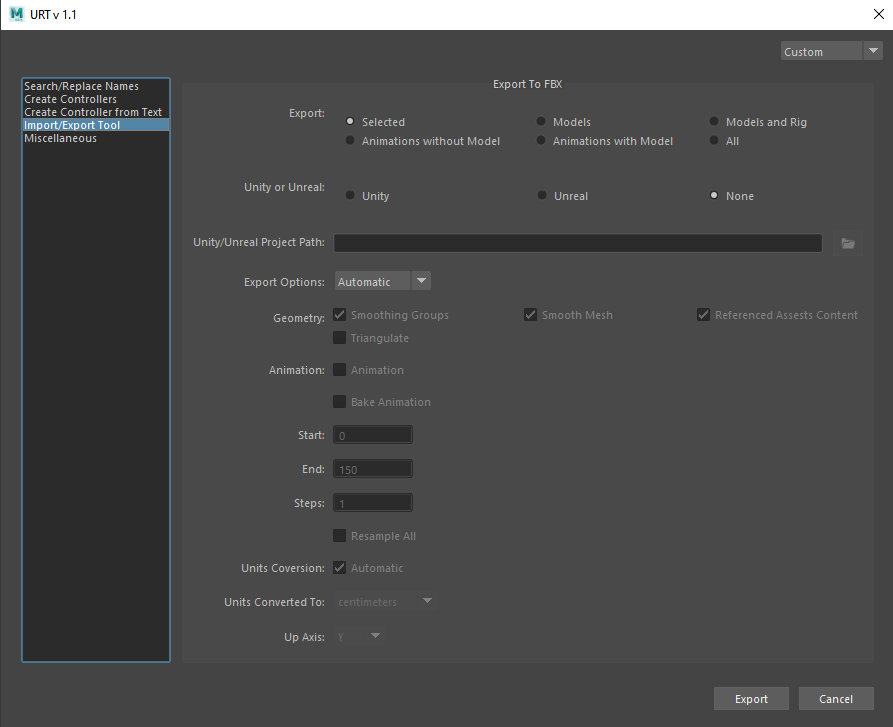

[Helper Scripts](helperScripts.md)

<h1 style="font-size:10vw">Export to FBX</h1>

[Description]  

[How-To Use Video]  
 

 

<table>
  <tr>
    <th>Item</th>
    <th>Description</th>
  </tr>
  <tr>
    <td><b>Export:</b></td>
    <td>
    <b>Selected:</b> Exports only the selected objects   
    <b>Models:</b> Exports all the models in the scene   
    <b>Models and Rig:</b> Exports all the models and skinned joints in the scene   
    <b>Animation without Model:</b> Exports only the skinned joints and animations in the scene (no models included)   
    <b>Animations with Model:</b> Exports models, skinned joints, and animations in the scene   
    <b>All:</b> Exports everything in the scene (including the lights and the cameras)
    </td>
  </tr>
  <tr>
    <td><b>Unity or Unreal:</b></td>
    <td>
    <b>Unity:</b> Select to export to a Unity Project   
    <b>Unreal:</b> Select to export to an Unreal Project   
    <b>None:</b> Select to export to the selected folder
    </td>
  </tr>
  <tr>
    <td><b>Unity/Unreal Project Path:</b></td>
    <td>Browse the Unreal or Unity project path</td>
  </tr>
  <tr>
    <td><b>Export Options:</b></td>
    <td>
    <b>Automatic:</b> Select to export with pre-determined options based on the selections made in the ‘Export’ above 
                      Note: If exporting animations, only the current timeframe is exported.  
    <b>Manual:</b> Select to export using manual options
    </td>
  </tr>
  <tr>
    <td><b>Geometry:</b></td>
    <td>
    <b>Smoothing Groups:</b> When you activate this option the Maya FBX plug-in converts edge information to Smoothing Groups and exports them with the file. 
                            When this option is disabled, no edge information is converted to Smoothing Groups.  
    <b>Smooth Mesh:</b> The Smooth Mesh option lets you export source mesh with Smooth mesh attributes. To export the source mesh, disable the Smooth mesh Preview attribute in Maya, and then export.   
    <b>Referenced Assets Content:</b> Activate the Referenced Asset Content option so that the referenced asset is exported, along with its contents. In other words, containers are exported with any data associated with them. If you activate the Referenced Asset Content option, your references instead become objects in the exported FBX file.   
    <b>Triangulate:</b> This option automatically tessellates exported polygon geometry. 
                        Note: This option affects Polygon Meshes, not NURBS.
    </td>
  </tr>
  <tr>
    <td><b>Animation:</b></td>
    <td>
    <b>Animation:</b> Enable to export animations from the scene   
    <b>Bake Animation:</b> Enable to bake the animation when exporting the objects from the scene. (Only enable this if the animations are not already baked onto the joint) 
                            Note: When in ‘Automatic Export Option’ the animations are baked properly. If in ‘Manual Export Option’ the animations are baked according to ‘FBX Export Options’ in Maya.  
    <b>Start:</b> Input the start timeline frame for the animation export   
    <b>End:</b> Input the end timeline frame for the animation export   
    <b>Steps:</b> The Step value defines how many keys are created per frame and has a value of 1 by default. Setting a Step value of 2 for example, only bakes, and exports a key every other frame.  
    <b>Resample All:</b> Use the Resample All option to bake even the supported animated elements. This is unlike the Bake Animation option which selectively bakes unsupported elements only.
    </td>
  </tr>
  <tr>
    <td><b>Units Conversion:<b></td>
    <td>Enable to automatically convert the units</td>
  </tr>
  <tr>
    <td><b>Units Converted To:<b></td>
    <td>Select the unit to convert to</td>
  </tr>
  <tr>
    <td><b>Up Axis:<b></td>
    <td>Select the axis to be determined as the up axis, Y-Up or Z-Up.</td>
  </tr>
</table>
