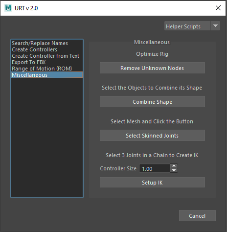

* [Helper Scripts](helperScripts.md)

[Description]  

[How-To Use Video]  
 

 

<table>
  <tr>
    <th>Item</th>
    <th>Description</th>
  </tr>
  <tr>
    <td><b>Optimize Rig:</b></td>
    <td>Optimizes the rig and removes all the unknown nodes from the scene</td>
  </tr>
  <tr>
    <td><b>Combine Shape:<b></td>
    <td>Combines the shapes of the selected objects to form one single object</td>
  </tr>
  <tr>
    <td><b>Select Skinned Joints:<b></td>
    <td>Selects all the joints that are skinned to the selected mesh</td>
  </tr>
  <tr>
    <td><b>Setup IK:<b></td>
    <td>Sets up Inverse Kinematic (IK) rig for the selected 3 joints. 
        Note: Always select 3 joints to create the IK, no more, no less.  
        <b>Controller Size:</b> Determines the size of the controllers
    </td>
  </tr>
</table>