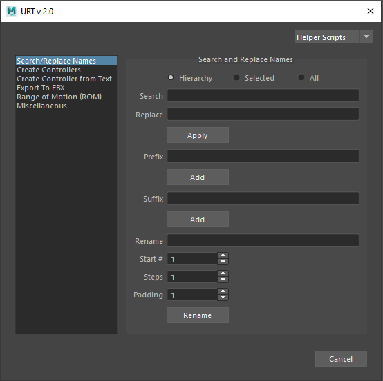

* [Helper Scripts](helperScripts.md)

[Description]  

[How-To Use Video]  
 

 

<table>
  <tr>
    <th>Item</th>
    <th>Description</th>
  </tr>
  <tr>
    <td><b>Hierarchy:</b></td>
    <td>Renames the entire hierarchy of the selected object/s</td>
  </tr>
  <tr>
    <td><b>Selected:<b></td>
    <td>Renames only the selected object/s</td>
  </tr>
  <tr>
    <td><b>All:<b></td>
    <td>Renames all the DAG objects in the scene</td>
  </tr>
  <tr>
    <td><b>Search:<b></td>
    <td>Input the string that is to be replaced</td>
  </tr>
  <tr>
    <td><b>Replace:<b></td>
    <td>Input the string to replace by</td>
  </tr>
  <tr>
    <td><b>Prefix:<b></td>
    <td>Input the string to add in front of the object name</td>
  </tr>
  <tr>
    <td><b>Suffix:<b></td>
    <td>Input the string to add to the back of the object name</td>
  </tr>
  <tr>
    <td><b>Rename:<b></td>
    <td>Input the string to replace the object name by</td>
  </tr>
  <tr>
    <td><b>Start #::<b></td>
    <td>Input the number with which to start from in the name</td>
  </tr>
  <tr>
    <td><b>Steps:<b></td>
    <td>Input the number to determine the steps for the next number to follow.</td>
  </tr>
  <tr>
    <td><b>Padding:<b></td>
    <td>Input the number of paddings for the number 
        eg: ‘Padding = 3’ gives ‘001’ or ‘Padding = 5’ gives ‘00001’</td>
  </tr>
</table>
